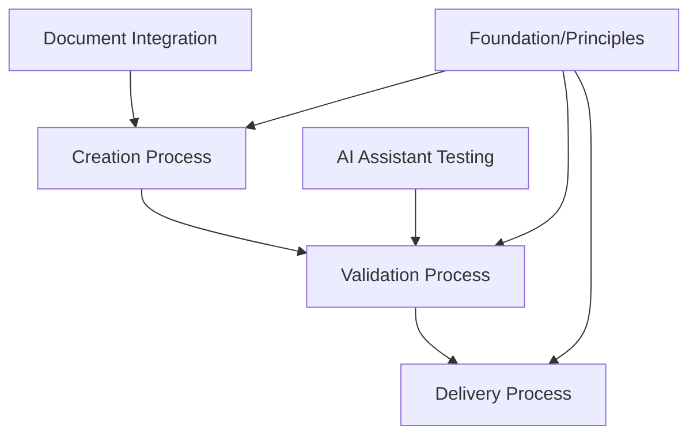

# Processes Index

## Purpose
This index provides an overview of all process documentation for the project, including workflows, standards, and best practices.

## Available Processes

### Core Development Processes

#### [Creation Process](creation.md)
Outlines the creation process for the project, including workflows, standards, and best practices for developing new features and components.

**Key Topics:**
- Creation workflow overview
- Work environments (local, collaborative, validation, pre-release, release)
- Quality standards and guidelines
- Version control and change tracking
- Documentation requirements
- CI/CD pipeline

---

#### [Validation Process](validation.md)
Describes the validation process, including strategies, methods, and best practices for ensuring quality.

**Key Topics:**
- Validation types (unit, integration, system, acceptance)
- Validation environments
- Validation strategies (functional, performance, security, usability)
- Validation automation and continuous validation
- Validation metrics and documentation

---

#### [Delivery Process](delivery.md)
Details the delivery process for releasing and deploying work products.

**Key Topics:**
- Delivery workflow
- Release management
- Deployment strategies
- Rollback procedures

---

### Supporting Processes

#### [Document Integration](document_integration.md)
Process for integrating documents from the inbox into the context network.

**Key Topics:**
- Document review and analysis
- Integration workflow
- Archiving processed documents
- Updating context network indexes

---

#### [AI Assistant Testing](ai-assistant-testing.md)
Guidelines for AI assistants when testing applications to prevent accidentally terminating critical processes.

**Key Topics:**
- Safe process management practices
- PID tracking and process isolation
- Prohibited commands (pkill, killall patterns)
- Testing workflow and best practices
- Example safe testing patterns

**Created:** 2025-11-15 (lesson learned from TUI session termination)

---

## Process Relationships

## Navigation

### For New Team Members
1. Start with [Creation Process](creation.md) to understand the development workflow
2. Review [Validation Process](validation.md) to understand quality standards
3. Check [Delivery Process](delivery.md) to understand release procedures

### For AI Assistants
1. **Always** review [AI Assistant Testing](ai-assistant-testing.md) before running application tests
2. Follow [Document Integration](document_integration.md) when processing inbox documents
3. Apply process guidelines from [Creation Process](creation.md) during development

### For Process Updates
When updating process documentation:
1. Update the relevant process document
2. Update this index if adding new processes
3. Record changes in `meta/updates/infrastructure/index.md`
4. Update relationship diagrams if connections change

## Quick Reference

| Process | Use When | Key Outcome |
|---------|----------|-------------|
| Creation | Developing new features or components | Quality work products following standards |
| Validation | Ensuring work meets requirements | Verified, tested deliverables |
| Delivery | Releasing or deploying work | Successfully deployed products |
| Document Integration | Processing inbox documents | Organized, integrated knowledge |
| AI Assistant Testing | Testing applications | Safe, isolated testing without session loss |

## Metadata
- **Created:** 2025-11-15
- **Last Updated:** 2025-11-15
- **Updated By:** AI Assistant (OpenCode)

## Change History
- 2025-11-15: Initial creation of processes index
- 2025-11-15: Added AI Assistant Testing process document
